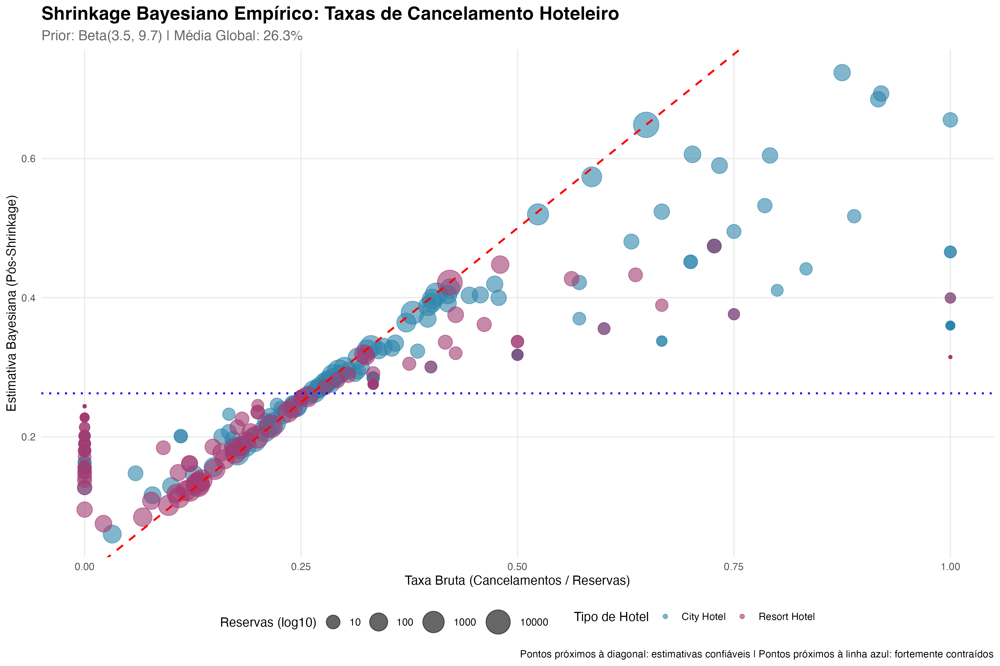
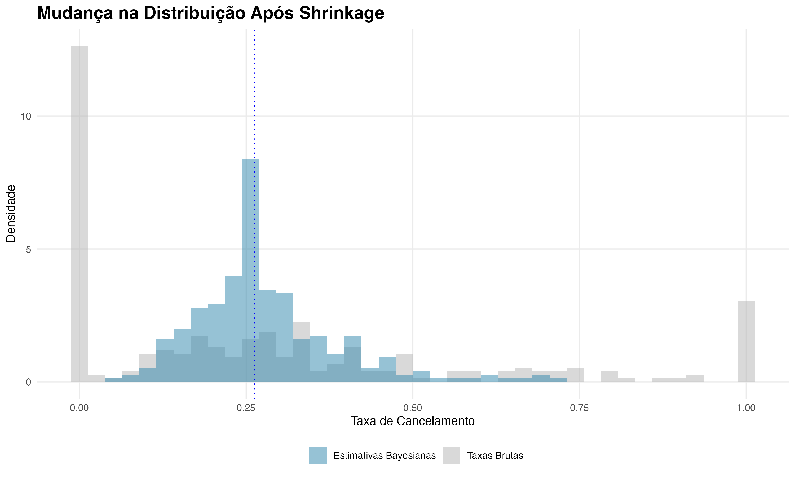

# 🏨 Empirical Bayes Shrinkage para Análise de Cancelamentos Hoteleiros

## 📌 Visão Geral

Este projeto resolve um problema real e recorrente em análise de dados: a estimação de taxas com amostras pequenas. Utilizando estimação Bayesiana empírica, demonstro como métricas brutas (ex: taxas de cancelamento) podem ser enganosas quando baseadas em poucas observações e como o método de shrinkage produz resultados mais confiáveis.

Dataset: Hotel Booking Demand (Kaggle)
Técnica principal: Empirical Bayes com prior Beta
Objetivo: Identificar verdadeiros problemas de cancelamento sem ruído estatístico

## 🎯 O Problema de Negócio

Imagine gerenciar uma rede de hotéis e se deparar com este relatório:

| Segmento | Reservas | Cancelamentos | Taxa Bruta | Problema |
|----------|----------|---------------|------------|----------|
| City Hotel + Andorra | 2 | 2 | 100% | Amostra pequena (não confiável) |
| City Hotel + Portugal | 48.590 | 20.552 | 42,3% | Amostra grande (confiável) |

A intuição diria: "Feche a operação em Andorra imediatamente!" Mas essa decisão seria baseada em ruído, não em realidade.

## 🧠 A Solução Bayesiana

### O Prior (aprendido dos dados)
Antes de analisar cada hotel, o método aprende uma distribuição global:

α₀ = 3.45 (cancelamentos "fictícios")
β₀ = 9.69 (não-cancelamentos "fictícios")
Média global = 26.3%
Peso do prior = 13.14 reservas

### A Fórmula do Shrinkage

estimativa_bayesiana = (cancelamentos_reais + 3.45) / (reservas_reais + 13.14)

## 📈 Resultados

### Efeito do Shrinkage

| Hotel | País | Reservas | Taxa Bruta | Est. Bayesiana | Shrinkage |
|-------|------|----------|------------|----------------|-----------|
| City Hotel | Honduras | 1 | 100% | 31.5% | 68.5% |
| City Hotel | Benin | 3 | 100% | 40.0% | 60.0% |
| City Hotel | Macau | 15 | 100% | 65.6% | 34.4% |
| City Hotel | Portugal | 48.590 | 42.3% | 42.3% | 0.0% |

### Comparação entre Hotéis

| Hotel | Segmentos | Reservas | Taxa Bruta | Taxa Bayesiana | Diferença |
|-------|-----------|----------|------------|----------------|-----------|
| City Hotel | 167 | 79.330 | 41.7% | 51.5% | +9.8% |
| Resort Hotel | 126 | 40.060 | 27.8% | 29.8% | +2.0% |

Insight: O City Hotel tem problemas mais graves do que a média bruta sugere, especialmente em mercados pequenos.

## 📊 Visualizações

*Figura 1: Taxa Bruta vs Estimativa Bayesiana. Quanto menor o ponto (poucas reservas), maior o movimento em direção à média global.*

*Figura 2: Distribuição antes e depois do shrinkage. Os extremos (0% e 100%) são eliminados.*

## 🚀 Como Reproduzir

### Pré-requisitos
R >= 4.0.0
RStudio (recomendado)
Git

### Execução

git clone https://github.com/santos-design/empirical-bayes-hotel.git

install.packages(c("tidyverse", "MASS", "VGAM", "gridExtra", "knitr", "bbmle"))

source("scripts/analyse_hotel.R")

Dados: Baixe o dataset do Kaggle e coloque hotel_bookings.csv na pasta data/.

## 📁 Estrutura

empirical-bayes-hotel/
├── scripts/          # Código fonte
├── data/             # Dados brutos (não versionados)
├── outputs/          # Resultados processados (.csv)
├── figs/             # Visualizações (.png)
└── README.md         # Documentação

## 👨‍💻 Autor

**Ivan Santos**

LinkedIn: https://www.linkedin.com/in/ivan-santos-8046a8355/

GitHub: https://github.com/santos-design
